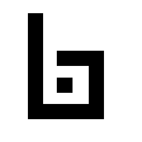

<div align="center">



# Byzcard

### Your identity is not a subscription.

Open source · Local-first · No account · No subscription · MIT

$0/month · QR + NFC · Clean links · Works offline · Fully customizable

<br>

**[Create yours →](https://byzcard.cc)**

[byzcard.cc](https://byzcard.cc) · [Source](https://github.com/NeerajMohanty/byzcard)

<br>

[](LICENSE)
[](https://github.com/NeerajMohanty/byzcard/actions/workflows/ci.yml)

</div>

<br>

# Stop renting your business card.

Most digital business cards work the same way.

Create a profile. Add your details. Get a link. Then keep paying every month.

**Byzcard does not.**

Create your card.

Keep it.

Share it.

Done.

No account.
No subscription.
No central card database for the core experience.
No lock-in.

<br>

# One link. Your name.

```
byzcard.cc/neeraj-mohanty
```

Your Byzcard can have a clean link based on your name.

Easy to remember.
Easy to share.
Easy to put in your bio.

```
byzcard.cc/john-doe
byzcard.cc/mary-oconnor
byzcard.cc/krishna-kumaravel
```

<br>

# One button.

```
SHARE

[ Share card ]
```

Tap **Share card** and Byzcard hands your link to your phone's own share sheet.

On iPhone that is the normal iOS share sheet, so the system offers what you already have: AirDrop, Messages, Mail, WhatsApp, Copy, and your other apps.

No custom picker. No extra steps.

The clean link is prepared quietly in the background. If the clean-link service is ever unavailable, Byzcard shares the self-contained card link instead. The button stays the same.

<br>

# Local-first, precisely.

Your card is created and stored locally by default.

The core card does not require an account or a central profile database.

A self-contained share URL carries the card itself in the URL fragment:

```
byzcard.cc/s/neeraj-mohanty#<payload>
```

The recipient's browser reads the fragment and renders the card. No central card lookup is required for this core sharing mode.

The QR code, NFC tags and Wallet passes all carry that self-contained URL. Durable, physical sharing should not depend on an optional service.

<br>

<div align="center">

# $0/month.

Not a trial.

Not a freemium tier.

Free.

</div>

<br>

# Your business card should survive the company that made it.

The core card is self-contained.

The recipient needs no account.

The card is not fundamentally tied to a hosted profile record.

Self-contained sharing works even without the clean-link redirect service. The clean link itself is a convenience layered on top; the card underneath does not depend on it.

<br>

| Typical digital card SaaS   | Byzcard                   |
| --------------------------- | ------------------------- |
| Monthly subscription        | **$0**                    |
| Account required            | **No account**            |
| Hosted profile database     | **Local-first core**      |
| Proprietary                 | **Open source**           |
| Vendor lock-in              | **Self-hostable**         |
| Limited customization       | **Fully customizable**    |
| Platform controls your card | **You control your card** |

<br>

# What you get

- Local-first card creation
- No account
- No subscription
- Progressive Web App
- Home Screen installation
- Offline support
- QR sharing
- NFC sharing
- vCard
- Native Web Share
- Clean human-readable URLs
- Self-contained share URLs
- Local photo processing
- Backup export/import
- ID card printing
- Event badge printing
- Mobile-first interface
- Open source
- Self-hostable
- MIT licensed

<br>

# On your Home Screen

Byzcard can be installed to your phone's Home Screen as a Progressive Web App.

The icon opens straight to your card and its QR code. No native app download is required for the core experience.

<br>

# Keep a backup

Local-first means the card lives on your device, so keep a backup.

Byzcard exports your card and photo as a single file and imports it again on any device. Save it wherever you like: iCloud Drive, Google Drive, Dropbox, your computer, anywhere.

Byzcard never uploads backups on its own.

<br>

# Print it

Two formats, from your browser's print dialog, with the QR code on the card:

| Format           | Size             |
| ---------------- | ---------------- |
| Standard ID Card | 3.375 × 2.125 in |
| Event Badge      | 4 × 6 in         |

<br>

# Why does this exist?

A business card is simple.

A name.
A role.
A company.
A few contact details.
A few links.
A QR code.

That should not need another permanent subscription.

So Byzcard does not have one.

<br>

# What Byzcard is not

Byzcard is not trying to become:

- a CRM
- a social network
- an advertising network
- a contact-data marketplace
- an analytics surveillance platform
- another subscription

It is a business card.

That is enough.

<br>

# Open source, so make it yours

Want a different layout?
Change it.

Want different branding?
Change it.

Want your own domain?
Use one.

Want to remove short links?
Remove them.

Want to build your own version?
Fork it.

Before adding something large, ask:

> Does this make the business card better, or does it just make Byzcard bigger?

Prefer the first.

<br>

---

<br>

## Architecture

Core:

```
Your device
    ↓
Create card
    ↓
Self-contained URL
/s/name#payload
    ↓
QR / NFC / Share / recipient
```

Optional clean URL:

```
byzcard.cc/name
    ↓
short-link lookup
    ↓
byzcard.cc/s/name#payload
    ↓
recipient
```

Byzcard is a Next.js app. Card creation, editing, photo processing, QR generation, vCard generation, NFC payloads, backup export/import, printing and offline use all run in the browser. The only server functionality is a pair of optional, stateless Wallet signing endpoints and the optional clean-link endpoints described below. Details: [docs/ARCHITECTURE.md](docs/ARCHITECTURE.md).

## Privacy

Two sharing modes, two different promises.

**Self-contained card** — `byzcard.cc/s/name#<payload>`. The card travels inside the link. Browsers never send the fragment to the server, so the server sees only the path. No central card database is involved.

**Clean short link** — `byzcard.cc/name`. This redirects to the self-contained URL above. For it to work, the configured short-link service stores a redirect mapping from the slug to the self-contained destination URL. That destination contains the encoded, compressed card payload. It is not encrypted, and it is not database-free: the clean link requires that redirect mapping.

Byzcard adds no analytics and no tracking. QR codes, NFC tags and Wallet passes always use the self-contained URL.

## Optional clean-link infrastructure

Clean links are optional per deployment. Byzcard supports a separately deployed open-source short-link service; the official deployment uses [Sink](https://github.com/miantiao-me/Sink) on a Cloudflare Worker with D1 and KV, hosted separately from Byzcard itself. Byzcard talks to it only over its HTTP API.

Sink is separate AGPL-3.0 software. Byzcard remains MIT, and no Sink source is part of this repository. Optional clean links can be backed by a separately deployed Sink instance.

Setup, the ownership model and the privacy details live in [docs/SHORT_LINKS.md](docs/SHORT_LINKS.md).

## Self-hosting

```bash
git clone https://github.com/NeerajMohanty/byzcard.git
cd byzcard
npm install
npm run dev
```

The core application works without configuring the optional short-link service or Wallet credentials. Copy `.env.example` to `.env.local` and set `NEXT_PUBLIC_APP_URL` to your origin when you deploy. Deployment notes: [docs/DEPLOYMENT.md](docs/DEPLOYMENT.md). Wallet passes: [docs/WALLET_SETUP.md](docs/WALLET_SETUP.md).

## Development

```bash
npm run dev            # local development server
npm run format:check   # Prettier
npm run lint           # ESLint
npm run typecheck      # TypeScript
npm run test           # unit and integration tests (Vitest)
npm run build          # production build
npx playwright test    # browser tests (Chromium + WebKit, mobile + desktop)
```

`npm run verify` runs the first five checks in one go.

## Contributing

Issues and pull requests are welcome. Keep changes focused, keep the core local-first and account-free, and add tests for behaviour you touch.

## License

[MIT](LICENSE). Third-party notices: [THIRD_PARTY_NOTICES.md](THIRD_PARTY_NOTICES.md).

<br>

<div align="center">

# Stop renting your business card.

### Build it once. Keep it yours.

**[Create yours →](https://byzcard.cc)**

https://byzcard.cc

</div>
